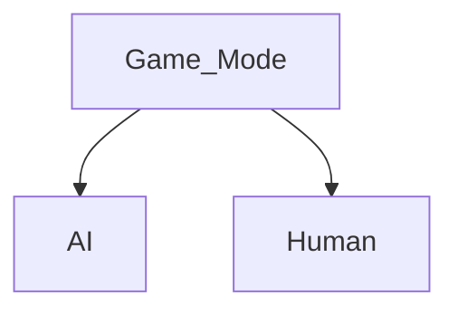
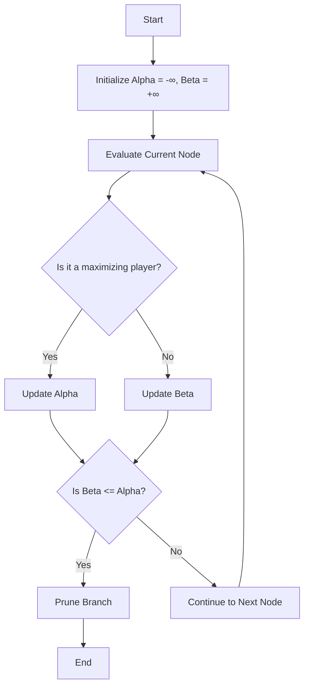

<h1>
  
  <span style="vertical-align:middle;">Tic Tac Toe</span>
 

</h1>

<h2> <a href="https://tic-tac-toe-gules-iota-86.vercel.app/" target="_blank" >to Play the Game</a> </h2>

> Simple Tic Tac Toe Game with 2 Options to play against Human and Play against Computer 


 
## Local Setup 

* 1st Need to Clone the repo
  
 ```
git clone https://github.com/Muhammad-Osama-9/Tic-Tac-Toe.git
 ```
* 2nd install node.js
  * after install node run this command to make sure its installed
    ```
    node --version 
    ```
*  3rd run node command to install all missing packadges
  ```
    npm install 
  ```
* 4th run local host using vite
```
npm run dev 
```


## game Modes 



## Ai 
* Ai algorihtm used is MiniMax algorithm with &alpha; and &beta; Pruning
  > this algorithm make very powerful non losing Computer 
  



